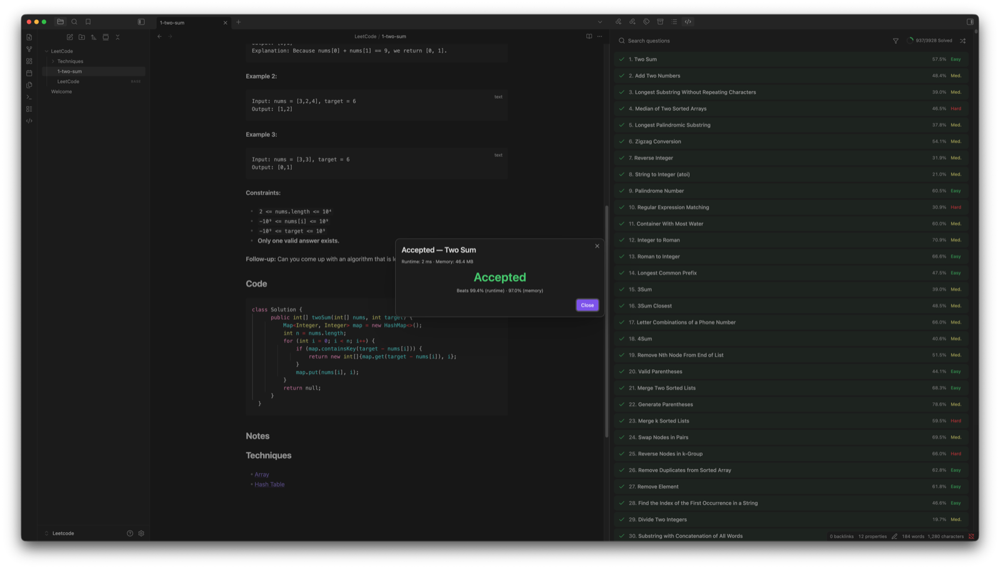
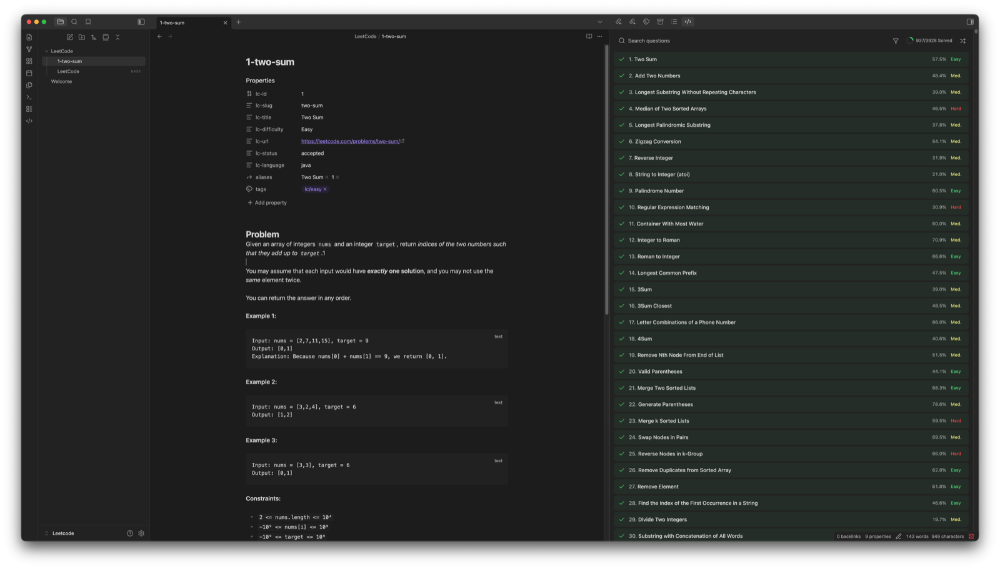
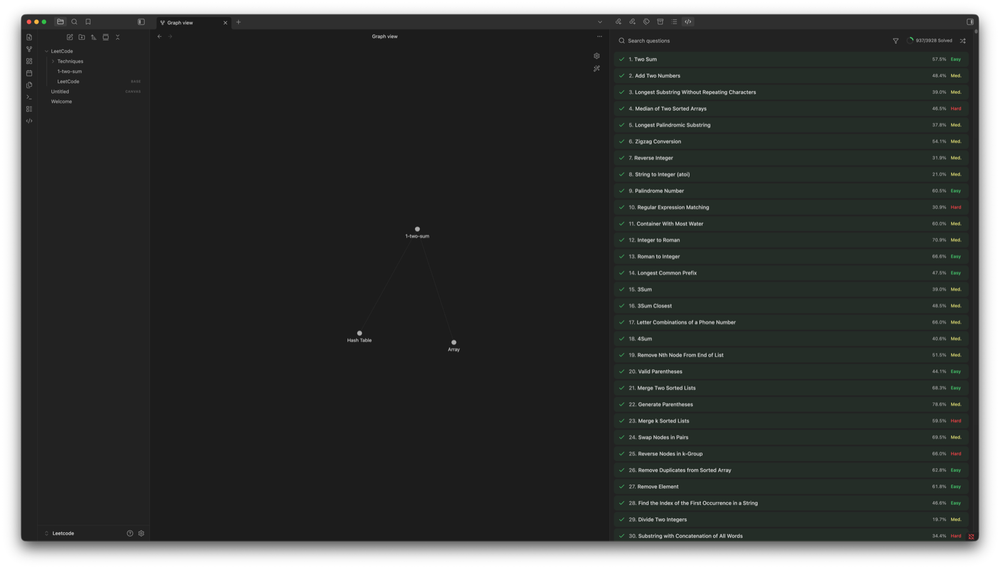
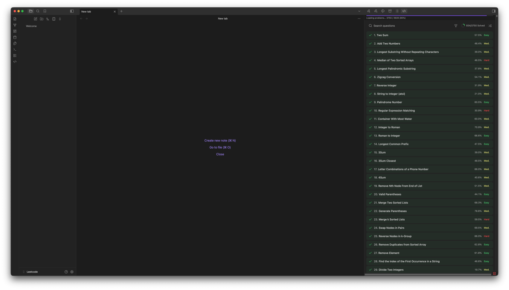

# LeetCode for Obsidian

Browse, solve, and note LeetCode problems inside your Obsidian vault. Every
solved problem becomes a first-class note — tagged, linked, and discoverable —
so practice builds a knowledge graph instead of scattered code files.

## Features

- Browse the LeetCode problem list with search + difficulty/status filters
- Preview any problem in a read-only tab before committing — single-click previews by default; shift-click still opens the note directly
- Open any problem as an Obsidian note with locked frontmatter and a `## Problem` statement rendered as Markdown
- Write solutions in a native fenced code block — no custom editor, no separate editor pane
- Run your code against sample or custom test cases with `LeetCode: Run`
- Submit to LC's judge with `LeetCode: Submit`; every verdict type (AC, WA, TLE, MLE, CE, RE) is surfaced
- On Accepted, the plugin updates frontmatter and writes `[[Technique]]` backlinks, turning your vault into a knowledge graph of solving techniques
- Browse your past LC submissions with `LeetCode: View past submissions`
- Previously fetched problems stay readable offline

## Install

### From the Obsidian community plugin store (recommended, after v0.1.0 acceptance)

1. Open Obsidian → Settings → Community plugins → Browse
2. Search for `LeetCode`
3. Install, then Enable

### Manual install (from release assets, pre-acceptance)

1. Download `manifest.json`, `main.js`, and `styles.css` from the latest [GitHub release](https://github.com/LikeSundayLikeRain/obsidian-leetcode/releases)
2. Copy them into `.obsidian/plugins/leetcode/` inside your vault
3. Open Obsidian → Settings → Community plugins → enable `LeetCode`

## Usage walkthrough

1. Install and enable the plugin.
2. Log in: Settings → LeetCode → `Log in`. An embedded window captures your `leetcode.com` session cookie after you sign in normally. If the embedded window does not work on your platform, paste your `LEETCODE_SESSION` cookie into the manual-cookie field instead.
3. Open the problem browser via the ribbon icon or the `LeetCode: Open problem browser` command.

   

4. Click any problem. The plugin creates a note at `{Problems folder}/{id}-{slug}.md` with the problem statement, frontmatter, and a fenced code block ready for your solution.

   

5. Write your solution in the `## Code` fenced block. `Run` and `Submit` buttons appear inline directly below the code block in both Reading mode and Edit mode (Live Preview + Source). The command palette (`LeetCode: Run`, `LeetCode: Submit`) also works.
6. When you are ready, click `Submit`. The verdict modal shows the result, runtime, memory, and percentile:

   

7. On Accepted, the plugin writes `[[Technique Name]]` wikilinks under a `## Techniques` section and creates stub technique notes. Open Obsidian's Graph view to see the knowledge graph forming:

   

## Previewing problems

Single-click on a problem in the LeetCode browser previews it in a new tab. Shift-click opens the note directly. The preview tab is read-only — it shows the problem statement, difficulty, and topic chips with a sticky `Start Problem` button at the top, and creates no `.md` file in your vault until you click `Start Problem` (or shift-click the row in the browser).

- **Right-click** any problem in the browser and pick `Preview problem` to preview regardless of your default click behavior.
- Run `Open in preview` from the command palette while viewing a problem note to re-open the preview tab for that problem.
- Open Settings → Preview → Click behavior. Choose `Preview first` (default) or `Open note directly` to restore v1.0 behavior. The setting persists across reloads.

Only one preview tab is open at a time — clicking another problem reuses the same tab. After you click `Start Problem`, the preview detaches itself and the new note takes focus.

## Network usage

This plugin communicates with leetcode.com to fetch problems and submit solutions. No other network endpoints are contacted.

Authentication is handled via an embedded Obsidian `BrowserWindow` that captures your LC session cookie after you sign in. The cookie is stored only in `.obsidian/plugins/leetcode/data.json` on your local machine, is never transmitted anywhere except leetcode.com, and is never logged.

## Configuration

Open Settings → LeetCode. Three sections:

- **Authentication** — log in, log out, or paste a session cookie manually as a fallback.
- **Notes** — choose the vault folder for problem notes (default: `LeetCode`) and the default language (default: `python3`).
- **Knowledge Graph** — override the technique-notes folder (defaults to `{Problems folder}/Techniques`) and toggle automatic technique backlinks on Accepted submissions.

## Troubleshooting

- `LeetCode session expired. Log in again.` — your session cookie is no longer valid. Click the `Log in` action on the Notice, or open Settings → LeetCode → `Log in`.
- `LeetCode is rate limiting us. Try again in a moment.` — LC returned HTTP 429. The plugin auto-retries once after a short backoff; if you see this twice in a row, wait a few seconds and retry manually.
- `Couldn't reach LeetCode. Check your connection.` — your machine cannot reach `leetcode.com` (offline, DNS issue, firewall). Plugin does not auto-retry network failures.
- `LeetCode is slow to respond. Try again.` — LC did not answer within 10 seconds. Judge or network latency; retry manually.
- Run/Submit buttons don't appear — verify the note has `lc-slug` in its frontmatter (only LC-problem notes show the buttons). The buttons render in both Reading mode and Edit mode (Live Preview + Source). If they still don't appear after toggling the plugin off and on, check the developer console (Cmd-Option-I) for errors.

### Section Locking

Problem notes (any note with an `lc-slug` frontmatter entry) make plugin-owned regions read-only in Edit Mode (Live Preview + Source). The lock is silent: typing or pasting into a locked region simply has no effect — there's no Notice or warning. If you find yourself typing and the keystroke isn't appearing, check the heading you're under.

**Locked regions** (read-only):

````text
## Problem            ← heading + entire body
## Code               ← heading line only
```python             ← fence opener (including the language tag)
```                   ← fence closer
## Techniques         ← heading line only
## Notes              ← heading line only
````

**Editable regions:**

- The `## Code` body between the opening and closing fence — this is your active solving surface.
- The `## Techniques` body — you can add manual `[[Wikilinks]]` here; future AI-driven analysis will also write here.
- The `## Notes` body — your own notes about the problem, fully under your control.
- `## Custom Tests` (legacy section) — never locked; the plugin doesn't read or write it.

**Why this exists:** the plugin overwrites `## Problem` on background refresh, the `## Code` fence body on Past Submissions / Copy-to-Code, and `## Techniques` + frontmatter on Accepted submissions. Locking the heading lines and structural anchors prevents your edits from accidentally landing in regions the plugin is about to overwrite.

**Switching languages:** the fence opener line (e.g. ` ```python `) is locked, so you cannot rename the language by typing into the fence tag. Use the chevron dropdown next to the Run/Submit buttons — it rewrites the opener atomically (Cmd-Z reverts the change) and updates the `lc-language` frontmatter.

**Cursor behavior:** when the cursor lands inside a locked region (via click or arrow), it automatically snaps to the nearest editable position outside. You can still select across locked regions to copy text — only typing into a locked region is suppressed.

## License

Released under the [MIT License](LICENSE).

## Contributing

Issues and pull requests welcome at [github.com/LikeSundayLikeRain/obsidian-leetcode](https://github.com/LikeSundayLikeRain/obsidian-leetcode).

## Development

```bash
git clone https://github.com/LikeSundayLikeRain/obsidian-leetcode
cd obsidian-leetcode
npm install
npm run dev   # esbuild watch mode → main.js
npm test      # vitest
```

For local testing, copy `main.js`, `manifest.json`, and `styles.css` into `<your-vault>/.obsidian/plugins/leetcode/` and reload the plugin.

### Bundle size

The production bundle (`main.js`) is gated by a portable Node script, `scripts/check-bundle-size.mjs`, which runs as the last step of `.github/workflows/ci.yml` (after lint, test, and build).

- **Hard ceiling: 500 KB.** PRs that push `main.js` over 500,000 bytes fail CI and cannot be merged.
- **Soft warning: 400 KB.** Builds between 400 KB and 500 KB log a warning but still pass — treat warnings as a signal to investigate before the next release.
- **Current baseline: ~165.0 KB (168,953 bytes)** at v1.1 entry — well under the soft warning, with substantial headroom for future AI/contest features.

Run the gate locally before pushing:

```bash
npm run build && npm run check:bundle-size
```

Thresholds are hardcoded constants in the script (no baseline file is committed); CI is the source of truth.
